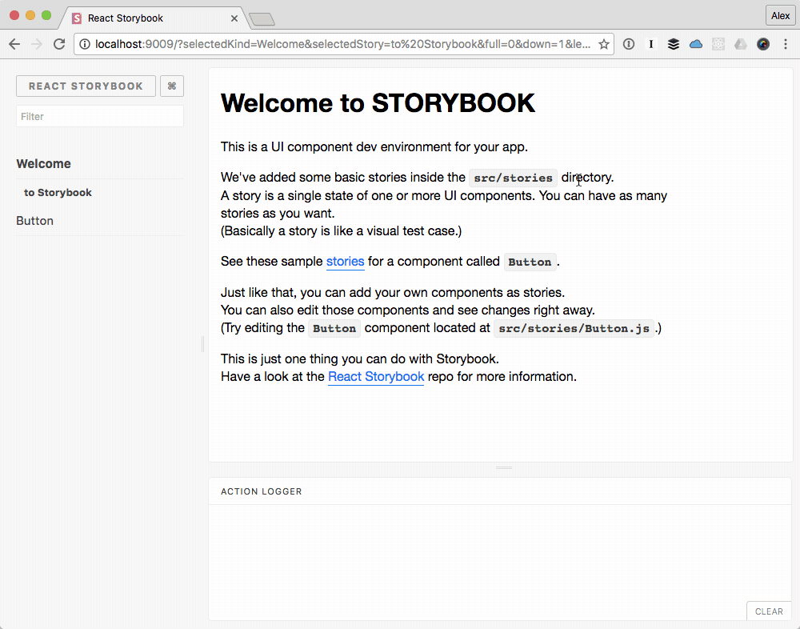

This is an example [Create React App](https://github.com/facebookincubator/create-react-app)
project that demonstrates how [Styled Components](https://styled-components.com/)
`ThemeProvider` breaks [React Storybook](https://getstorybook.io/).

I applied [styled-components theming](https://github.com/styled-components/styled-components#theming)
to all stories using the `addDecorator` function discussed in [React Storybook Issue #76](https://github.com/kadirahq/react-storybook/issues/76)
and in the [React Storybook documentation for Add Ons](https://getstorybook.io/docs/addons/introduction#storybook-decorators).

1 
